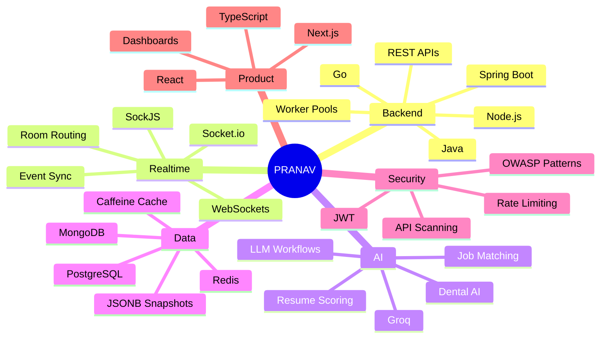

<p align="center">
  
</p>

<p align="center">
  
</p>

<p align="center">
  <a href="https://pranavsinghrajoria.vercel.app">
    
  </a>
  <a href="https://github.com/pranav8764">
    
  </a>
  <a href="https://www.linkedin.com/in/pranav-singh-rajoria-05a407314/">
    
  </a>
  <a href="https://leetcode.com/u/pranav8764/">
    
  </a>
  <a href="mailto:pranavrajoria1@gmail.com">
    
  </a>
</p>

---

## `> NULLFRAME SYSTEMS`

```txt
system.identity      : Pranav Singh Rajoria
role                 : Backend-focused Software Engineer
world                : NullFrame Systems
focus                : Backend · AI · Realtime · Security
institution          : ABV-IIITM Gwalior
status               : building systems that prefer logs over opinions
mission              : products built from architecture, not optimism
```

I build backend-heavy products, realtime systems, AI workflows, and security-focused platforms.

Most software fails quietly.
Mine logs the failure, isolates it, and keeps moving.

---

## `> CURRENT SIGNAL`

```txt
backend.core         : online
realtime.layer       : stable
ai.pipeline          : processing
security.scanner     : armed
data.layer           : indexed
cloud.workflow       : connected
optimism             : rejected
architecture         : holding
```

Currently focused on:

* Scalable backend systems
* Realtime collaboration infrastructure
* AI-powered workflows and developer tools
* API security and monitoring systems
* Cloud-backed pipelines
* Agentic AI + DevOps automation

---

## `> CORE MODULES`

| Module             | Stack                                                   |
| ------------------ | ------------------------------------------------------- |
| **Backend Core**   | Java · Spring Boot · Go · Node.js · Express             |
| **Realtime Layer** | WebSockets · SockJS · Socket.io                         |
| **AI Pipeline**    | Groq · LLM workflows · Resume scoring · Job analysis    |
| **Data Layer**     | PostgreSQL · MongoDB · Redis · JSONB · Caffeine         |
| **Cloud Layer**    | AWS S3 · AWS SQS · Vercel · Railway · Docker            |
| **Security Layer** | JWT · Rate limiting · OWASP patterns · Security headers |
| **Product Layer**  | Next.js · React · TypeScript · Tailwind · Konva.js      |

---

## `> FEATURED BUILDS`

### `01` Visync — Realtime Collaboration System

**Realtime collaborative whiteboard for teams, interviews, teaching, and visual collaboration.**

```txt
type        : realtime systems
stack       : Spring Boot · SockJS · Next.js · Konva.js · PostgreSQL · Redis
signal      : 90% payload reduction · 95% row reduction · <150ms board loads
```

* Built realtime drawing sync with room-based WebSocket communication.
* Used server-side routing and backpressure for stable event handling.
* Reduced drawing payload size using path simplification.
* Implemented snapshot compaction for faster board recovery.
* Added infinite canvas support, reconnection handling, and synchronized undo/redo.

[Repository](https://github.com/pranav8764/Visync)

---

### `02` SentinelAPI — API Security Scanner

**API vulnerability scanner and realtime security monitoring dashboard.**

```txt
type        : security engineering
stack       : Node.js · Express · MongoDB · Socket.io · JWT
signal      : 12 attack categories · 40+ threat patterns · realtime monitoring
```

* Built scanner coverage for SQL injection, NoSQL injection, XSS, command injection, CORS, SSL/TLS, and auth flow testing.
* Added middleware with threat pattern detection and NoSQL operator sanitization.
* Injected security headers such as CSP, HSTS, and X-Frame-Options.
* Built realtime traffic monitoring with Socket.io.
* Generated OWASP/CWE-style risk reports.

[Repository](https://github.com/pranav8764/SentinelAPI)

---

### `03` Job Match Analyzer — AI Resume Intelligence

**AI-powered resume-to-job matching system with explainable scoring and LLM suggestions.**

```txt
type        : AI product
stack       : React · Node.js · Express · MongoDB · Groq · Puppeteer
signal      : weighted ATS scoring · 500+ synonym dictionary · LLM suggestions
```

* Built weighted scoring across skills, experience, education, and responsibilities.
* Used fuzzy matching and a 500+ synonym dictionary.
* Built Puppeteer scrapers for JS-rendered career pages.
* Integrated Groq Llama 3.3 70B for targeted resume suggestions.
* Split backend into scraper, matcher, LLM, and PDF parser services.

[Repository](https://github.com/pranav8764/HireFT-Assignment)

---

### `04` MindBloom — Wellness Product System

**Gamified mental wellness tracker with journaling, achievements, challenges, and realtime rooms.**

```txt
type        : full-stack product
stack       : React · Node.js · Express · MongoDB · Socket.io
signal      : journaling · challenges · XP system · realtime rooms
```

* Built journaling, mood tracking, and progress visualization workflows.
* Added gamified challenges and achievement tracking.
* Used realtime rooms for community-style interactions.
* Designed product flows around engagement and habit-building.

[Repository](https://github.com/pranav8764/MIndBloom1)

---

### `05` OpsPilot — Agentic DevOps Assistant

**Agentic AI DevOps assistant for deployment, monitoring, debugging, and recovery workflows.**

```txt
type        : agentic AI + DevOps
stack       : Go · Next.js · PostgreSQL · pgvector · Redis · NATS · Python FastAPI
signal      : repo ingestion · deployment automation · recovery workflows
```

* Designed as a developer tool for deploying and monitoring projects.
* Focused on GitHub repo analysis, logs, infrastructure actions, and rollback decisions.
* Explores the intersection of backend engineering, AI agents, and DevOps automation.

[Repository](https://github.com/pranav8764/OpsPilot)

---

### `06` ParkIntel — Urban Intelligence Prototype

**Parking and congestion intelligence system for hotspot prediction and enforcement planning.**

```txt
type        : ML + urban systems
stack       : Go · Next.js · PostgreSQL · ONNX Runtime · ML models
signal      : hotspot prediction · API inference · urban decision support
```

* Built around parking violation and congestion intelligence.
* Explores ML-backed prediction, dispatch logic, and city-scale decision support.
* Designed as a product-style system rather than a notebook-only prototype.

[Repository](https://github.com/pranav8764/ParkIntel)

---

## `> EXPERIENCE.LOG`

### Software Engineering Intern — HireFT

```txt
status      : shipped
mode        : backend + AI workflows + cloud pipelines
timeline    : Mar 2026 - May 2026
```

```txt
Workday Scraper
  -> Worker Pool
  -> PostgreSQL Deduplication
  -> AWS SQS Queue
  -> AWS S3 Storage
  -> Groq Resume / ATS Enrichment
```

Built and shipped backend systems for scraping, enrichment, resume generation, and profile workflows.

* Built a concurrent job-scraping pipeline in Go using worker pools.
* Processed Workday ATS postings with PostgreSQL deduplication.
* Used AWS S3 storage and AWS SQS-driven enrichment queues.
* Designed a Groq-powered resume-generation flow.
* Improved job-to-role matching across 500K+ records using staged role resolution and Caffeine caching.
* Built REST APIs for profile management, presigned uploads, and auto-apply preferences.
* Added PDF hyperlink extraction using PDFBox.

```txt
worker.pool             : active
sqs.queue               : processing
deduplication           : stable
resume.pipeline         : shipped
redundant.lookups       : eliminated
architecture            : holding
```

---

## `> SYSTEM ARCHITECTURE MAP`



---

## `> PROOF OF WORK`

| Signal                   | Evidence                                                        |
| ------------------------ | --------------------------------------------------------------- |
| **Realtime Systems**     | Visync · SentinelAPI · MindBloom                                |
| **Backend Engineering**  | Spring Boot · Go · Node.js · worker pools · REST APIs           |
| **AI Workflows**         | Groq resume pipeline · job analysis · DentalAssistant direction |
| **Security Engineering** | SentinelAPI scanner · threat patterns · rate limiting           |
| **Data Systems**         | PostgreSQL · MongoDB · Redis · snapshots · deduplication        |
| **Product Thinking**     | Visync · Job Match Analyzer · MindBloom · OpsPilot              |

---

## `> TECH INVENTORY`

<p align="center">
  
</p>

<p align="center">
  
  
  
  
  
  
</p>

---

## `> CREDENTIALS`

```txt
education.verified      : ABV-IIITM Gwalior
program                 : B.Tech Electrical and Electronics Engineering
cgpa                    : 8.36
status                  : in_progress
```

```txt
leadership.detected     : Secretary, SAC Technical
operations.archived     : Operations Lead, IEEE
event.scale             : 2000+ registrations · 500+ finalists
```

---

## `> GITHUB TELEMETRY`

<p align="center">
  
  
</p>

<p align="center">
  
</p>

---

## `> COMBAT LOG`

<p align="center">
  
</p>

---

## `> FIND ME IN THE SYSTEM`

<p align="center">
  <a href="https://pranavsinghrajoria.vercel.app" target="_blank">
    
  </a>
  <a href="https://github.com/pranav8764" target="_blank">
    
  </a>
  <a href="https://www.linkedin.com/in/pranav-singh-rajoria-05a407314/" target="_blank">
    
  </a>
  <a href="https://leetcode.com/u/pranav8764/" target="_blank">
    
  </a>
  <a href="mailto:pranavrajoria1@gmail.com" target="_blank">
    
  </a>
</p>

---

<p align="center">
  <code>status: available_for_backend_internships</code>
  <br />
  <code>mode: building_systems</code>
  <br />
  <code>noise: filtered</code>
</p>

<p align="center">
  <b>If the architecture held your attention, the engineer is available.</b>
</p>

<p align="center">
  
</p>

<!--
Optional advanced GitHub Actions visuals:
Pac-Man and 3D contribution boards need generated SVG files first.
Add them only after setting up GitHub Actions in pranav8764/pranav8764.
-->
