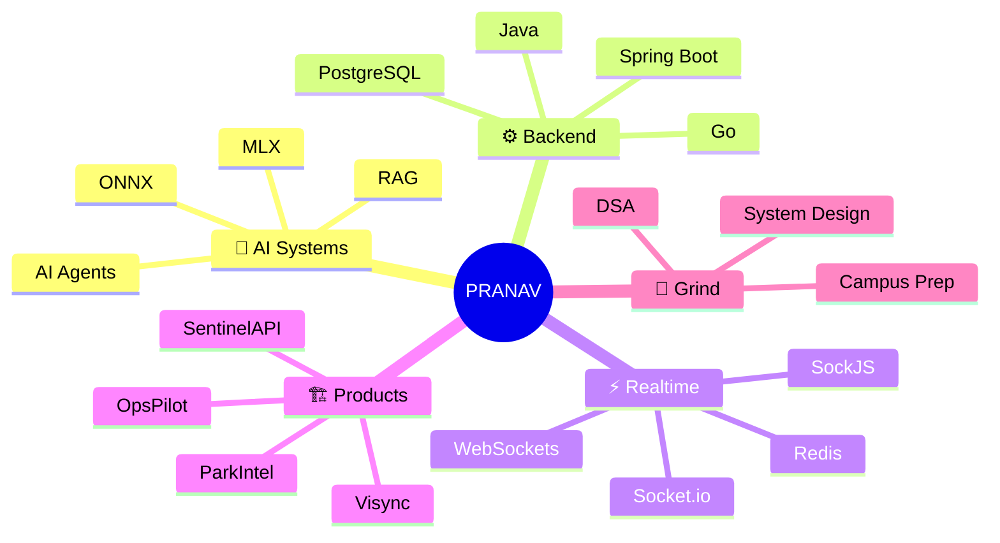

<p align="center">
  
</p>

<p align="center">
  
</p>

<p align="center">
  
  <a href="https://github.com/pranav8764?tab=followers">
    
  </a>
  <a href="https://github.com/pranav8764">
    
  </a>
</p>

---

## `> BOOT SEQUENCE`

```txt
> booting pranav.exe
> loading backend modules... OK
> loading realtime systems... OK
> loading ai agents... OK
> loading database layer... OK
> syncing quest log... OK
> status: ready to build
```

---


## `> PLAYER ONE`

```txt
CLASS    : Backend + AI Systems Engineer
GUILD    : ABV-IIITM Gwalior
WEAPON   : Java · Spring Boot · Go · Next.js · PostgreSQL
LORE     : Builds realtime products, backend systems, AI workflows, and security tools
STATUS   : [ON QUEST] — Agentic DevOps, DentalAI, DSA, and production-grade systems
```

| Stat | Loadout |
|---|---|
| **Class** | Backend / AI Systems Builder |
| **Main Weapon** | Java + Spring Boot |
| **Secondary Weapon** | Go + Python |
| **Frontend Kit** | Next.js + React + TypeScript |
| **Database Core** | PostgreSQL + MongoDB + Redis |
| **Current Level** | B.Tech EEE @ ABV-IIITM Gwalior |
| **Ultimate** | Turning rough product ideas into working systems |

<br clear="right" />

---

## `> XP PROGRESS`

```txt
Java + Spring Boot     ████████░░ 80%
Go Backend Systems     ███████░░░ 70%
Next.js + React        ████████░░ 80%
PostgreSQL + Redis     ███████░░░ 75%
AI Agents + RAG        ██████░░░░ 65%
DSA + Problem Solving  ███████░░░ 75%
System Design          ██████░░░░ 65%
```

---

## `> ACTIVE QUESTS 📋`

| Priority | Quest | Status |
|:---:|---|:---:|
| 🔴 | **OpsPilot** — agentic AI DevOps assistant for deploy, monitor, debug, and recovery workflows | `[IN PROGRESS]` |
| 🔴 | **Visync** — realtime collaborative whiteboard with low-latency sync and persistent board state | `[SHIPPING]` |
| 🟡 | **DentalAI / OpenDental** — ML + database intelligence for dental workflows | `[BUILDING]` |
| 🟡 | **DSA Grind** — Java problem solving for campus placements and interviews | `[ONGOING]` |
| 🟢 | **Backend Depth** — Spring Boot, Go services, PostgreSQL, queues, and scalable APIs | `[ALWAYS ACTIVE]` |

---

## `> SIDE QUESTS 🧩`

- Build clean, production-style backend services
- Improve realtime collaboration architecture
- Study distributed systems and database internals
- Build AI agents that work with real tools and repositories
- Write better documentation for every serious project
- Push more polished public repositories

---

## `> LOADOUT ⚙️`

| Build | Stack |
|---|---|
| **Backend Build** | Java · Spring Boot · Go · Node.js · Express |
| **Realtime Build** | WebSockets · SockJS · Socket.io · Redis |
| **AI Build** | Python · RAG · AI Agents · MLX · ONNX |
| **Frontend Build** | Next.js · React · TypeScript · Tailwind CSS |
| **Database Build** | PostgreSQL · MongoDB · Prisma · SQL |
| **Cloud / Infra Build** | Docker · AWS S3 · AWS SQS · Railway · Vercel |

---

## `> INVENTORY 🎒`

| Slot | Equipped |
|---|---|
| **Languages** | Java · Go · Python · JavaScript · TypeScript · C++ · SQL |
| **Backend Kit** | Spring Boot · Express.js · REST APIs · WebSockets · Microservices |
| **Frontend Kit** | Next.js · React · Tailwind CSS · Konva.js |
| **Database Kit** | PostgreSQL · MongoDB · Redis · Supabase |
| **AI Kit** | RAG pipelines · LLM workflows · MLX · ONNX Runtime |
| **DevOps Gear** | Docker · GitHub · Railway · Vercel · AWS |
| **Grinding Grounds** | LeetCode · Codeforces · GitHub · Hackathons |

---

## `> FEATURED BUILDS 🧱`

| Project | Type | Stack | Drop |
|---|---|---|---|
| **[Visync](https://github.com/pranav8764/Visync)** | Realtime Collaboration | Next.js · Spring Boot · PostgreSQL · Redis · SockJS | Collaborative whiteboard with drawing sync, rooms, chat, undo/redo, snapshots |
| **[OpsPilot](https://github.com/pranav8764/OpsPilot)** | Agentic DevOps | Go · Python FastAPI · NATS · PostgreSQL · pgvector · Next.js | AI assistant for repository ingestion, project Q&A, deployment workflows, and incident memory |
| **[ParkIntel](https://github.com/pranav8764/ParkIntel)** | ML + Civic Tech | Go · ONNX · PostgreSQL · Next.js · Docker | Illegal parking hotspot predictor and enforcement command center |
| **[DentalAssistant](https://github.com/pranav8764/DentalAssistant)** | AI Research | Python · MLX · Sparse Attention · TurboQuant · TurboVec | Experimental dental LLM architecture and OpenDental intelligence layer |
| **[SentinelAPI](https://github.com/pranav8764/SentinelAPI)** | Security Platform | Node.js · Express · MongoDB · Socket.io · JWT | API vulnerability scanner with realtime monitoring and security reports |
| **[MindBloom](https://github.com/pranav8764/MIndBloom1)** | Full-Stack Product | React · Node.js · Express · MongoDB · Socket.io | Gamified mental health tracker with journaling, challenges, and achievements |

---

## `> BOSS ARENA 💀`

| Boss | Weakness | Status |
|---|---|:---:|
| **Distributed Systems** | Consistency, queues, failure handling, service boundaries | `[FIGHTING]` |
| **Production Backend** | Clean APIs, database design, async jobs, observability | `[FIGHTING]` |
| **Agentic AI Reliability** | Tool calling, RAG quality, approvals, hallucination checks | `[FIGHTING]` |
| **Realtime Collaboration** | Low latency, state sync, conflict handling, reconnect flows | `[FIGHTING]` |
| **Interview DSA** | Patterns, DP, graphs, trees, and implementation speed | `[GRINDING]` |

---

## `> BOSS HP`

```txt
Production Backend       ████████░░ 80%
Realtime Systems         ████████░░ 80%
Agentic AI Reliability   ██████░░░░ 65%
Database Engineering     ███████░░░ 75%
System Design            ██████░░░░ 65%
Interview DSA            ███████░░░ 75%
```

---

## `> SKILL TREE 🌳`

<p align="center">
  
</p>

<p align="center">
  
  
  
  
  
  
  
</p>

---

## `> GAME MODES 🕹️`

| Mode | Focus |
|---|---|
| **Builder Mode** | Shipping full-stack products from idea to deploy |
| **Backend Mode** | APIs, databases, queues, auth, and scalable services |
| **AI Mode** | RAG, agents, ML workflows, and model-backed products |
| **Realtime Mode** | WebSockets, collaboration, live cursors, and sync engines |
| **Arena Mode** | DSA, hackathons, interview prep, and rapid prototypes |
| **Research Mode** | MLX, LLM internals, sparse attention, and database intelligence |

---

## `> DUNGEON MAP 🗺️`



---

## `> CHARACTER STATS 📊`

<p align="center">
  
  
</p>

<p align="center">
  
</p>

---

## `> COMBAT LOG ⚔️`

<p align="center">
  
</p>

---

## `> CONTRIBUTION BOARD 🧊`

<p align="center">
  
</p>

<p align="center">
  
  
</p>

---

## `> ACHIEVEMENTS UNLOCKED 🏆`

<p align="center">
  
  
  
  
  
</p>

<p align="center">
  
</p>

---

## `> RARE DROPS 💎`

| Drop | Source |
|---|---|
| **Realtime Whiteboard Architecture** | Visync build logs |
| **Agentic DevOps Product Design** | OpsPilot experiments |
| **ML Model Serving with Go** | ParkIntel ONNX integration |
| **API Security Testing Patterns** | SentinelAPI scanner |
| **LLM Internals Notes** | DentalAssistant / MLX experiments |
| **Debugging Instincts** | Long backend and deployment sessions |

---

## `> PROOF OF WORK 📜`

| Signal | Drop Location |
|---|---|
| ⚙️ **Backend Systems** | Spring Boot, Go services, REST APIs, WebSockets |
| 🧠 **AI Systems** | RAG workflows, MLX experiments, ONNX model serving |
| ⚡ **Realtime Products** | Collaborative whiteboards, live rooms, socket-based apps |
| 🛡️ **Security Tools** | API scanning, threat checks, monitoring dashboards |
| 🎯 **Practice** | LeetCode, Codeforces, DSA, hackathons |
| 🧭 **Direction** | Backend-heavy products with AI and production engineering |

---

## `> FIND ME IN THE LOBBY 🎮`

<p align="center">
  <a href="https://github.com/pranav8764" target="_blank"></a>
  <a href="https://linkedin.com/in/pranav-singh-rajoria" target="_blank"></a>
  <a href="https://leetcode.com/u/pranav8764/" target="_blank"></a>
  <a href="https://codeforces.com/profile/pranav.devvv" target="_blank"></a>
  <a href="mailto:pranavrajoria1@gmail.com" target="_blank"></a>
</p>

---

## `> FINAL TRANSMISSION`

```txt
> build simple
> scale carefully
> debug brutally
> ship consistently
```

<p align="center">
  
</p>
