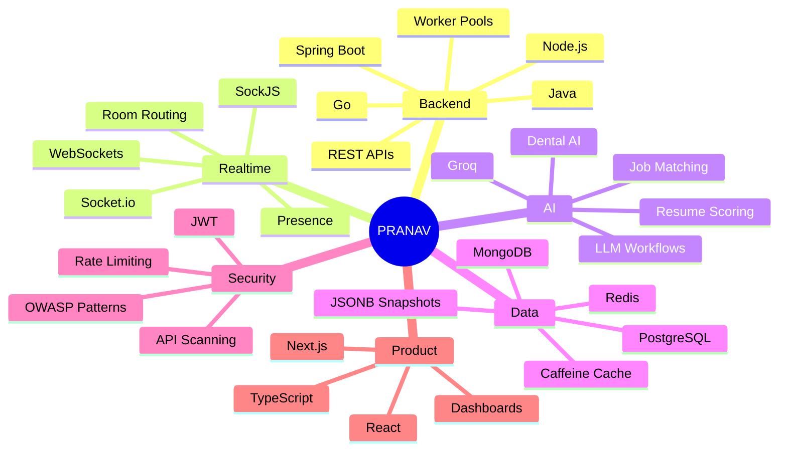

<p align="center">
  
</p>

<p align="center">
  
</p>

<p align="center">
  
  <a href="https://github.com/pranav8764?tab=followers">
    
  </a>
  <a href="https://github.com/pranav8764">
    
  </a>
</p>

---

## `> BOOT SEQUENCE`

```txt
> booting pranav.exe
> loading backend core.................. OK
> loading realtime infrastructure....... OK
> loading ai workflow engine............ OK
> loading security scanner.............. OK
> loading product architecture.......... OK
> status: ready to ship
```

---


## `> PLAYER ONE`

```txt
NAME     : Pranav Singh Rajoria
WORLD    : NullFrame Systems
CLASS    : Backend-focused Software Engineer
FOCUS    : Backend · AI · Realtime · Security
GUILD    : ABV-IIITM Gwalior
MISSION  : Build systems from architecture, not optimism.
STATUS   : [SHIPPING] scalable products and AI-backed workflows
```

| Stat | Loadout |
|---|---|
| **Primary Class** | Backend / Systems Engineer |
| **Main Weapon** | Java · Spring Boot · Go |
| **Secondary Weapon** | Next.js · React · TypeScript |
| **AI Module** | Groq · LLM workflows · Resume scoring · RAG direction |
| **Realtime Layer** | WebSockets · SockJS · Socket.io |
| **Database Layer** | PostgreSQL · MongoDB · Redis |
| **Passive Skill** | Replacing chaos with architecture |

<br clear="right" />

---

## `> XP PROGRESS`

```txt
Backend Systems        █████████░ 90%
Realtime Sync          ████████░░ 80%
AI Workflows           ███████░░░ 70%
Security Engineering   ███████░░░ 70%
Data Modeling          ████████░░ 80%
Frontend Products      ███████░░░ 70%
Cloud Pipelines        ██████░░░░ 60%
DSA / Problem Solving  ███████░░░ 70%
```

---

## `> ACTIVE QUESTS 📋`

| Priority | Quest | Status |
|:---:|---|:---:|
| 🔴 | **OpsPilot** — Agentic AI DevOps assistant for deploy, monitor, debug, and recovery workflows | `[BUILDING]` |
| 🔴 | **Visync** — realtime collaborative whiteboard with event persistence and fast board recovery | `[SHIPPED]` |
| 🟡 | **DentalAssistant** — domain-specific dental AI / database-backed assistant exploration | `[RESEARCH]` |
| 🟡 | **ParkIntel** — illegal parking hotspot prediction with Go API + ONNX inference | `[PROTOTYPED]` |
| 🟢 | **SentinelAPI** — API vulnerability scanner and realtime security dashboard | `[ARCHIVED]` |

---

## `> FEATURED BUILDS 🏗️`

| Build | What it does | Stack | Signal |
|---|---|---|---|
| **[Visync](https://github.com/pranav8764/Visync)** | Realtime collaborative whiteboard for teams, teaching, interviews, and visual collaboration | Spring Boot · SockJS · Next.js · Konva.js · PostgreSQL · Redis | `90% payload reduction · <150ms board loads` |
| **[OpsPilot](https://github.com/pranav8764/OpsPilot)** | Agentic AI DevOps assistant for small teams | Go microservices · Next.js · PostgreSQL · pgvector · Redis · NATS · Python FastAPI | `GitHub app + repo ingestion pipeline` |
| **[ParkIntel](https://github.com/pranav8764/ParkIntel)** | Illegal parking hotspot prediction and enforcement dispatch system | Go · Next.js · PostgreSQL · ONNX Runtime · LightGBM · XGBoost · Docker | `live ML inference served through API` |
| **[SentinelAPI](https://github.com/pranav8764/SentinelAPI)** | API security scanner with live monitoring and threat detection | Node.js · Express · MongoDB · Socket.io · JWT | `12 attack categories · 40+ threat patterns` |
| **[MindBloom](https://github.com/pranav8764/MIndBloom1)** | Gamified mental wellness tracker with journaling and realtime rooms | React · Node.js · Express · MongoDB · Socket.io | `journaling · challenges · XP system` |
| **[HireFT Assignment](https://github.com/pranav8764/HireFT-Assignment)** | Resume-to-job analyzer with explainable scoring and LLM suggestions | React · Node.js · MongoDB · Groq · Puppeteer | `500+ synonym dictionary · weighted ATS scoring` |

---

## `> SYSTEM ARCHITECTURE MAP 🗺️`



---

## `> LOADOUT ⚙️`

| Build Type | Stack |
|---|---|
| **Backend Build** | Java · Spring Boot · Go · Node.js · Express.js · REST APIs |
| **Realtime Build** | WebSockets · SockJS · Socket.io · ConcurrentHashMap routing |
| **AI Build** | Python · Groq · LLM workflows · resume scoring · job analysis |
| **Data Build** | PostgreSQL · MongoDB · Redis · JSONB snapshots · Caffeine caching |
| **Frontend Build** | Next.js · React.js · TypeScript · Tailwind CSS · Konva.js |
| **Cloud Build** | AWS S3 · AWS SQS · Vercel · Railway · Docker |
| **Security Build** | JWT · rate limiting · threat patterns · security headers · OWASP/CWE reports |

---

## `> INVENTORY 🎒`

<p align="center">
  
</p>

<p align="center">
  
  
  
  
  
  
  
</p>

---

## `> BOSS ARENA 💀`

| Boss | Weakness | Status |
|---|---|:---:|
| **Distributed Realtime State** | Server-authoritative events + snapshot compaction | `[FIGHTING]` |
| **AI Reliability** | Structured prompts + retrieval + evaluation loops | `[FIGHTING]` |
| **Production Deployment Chaos** | Agentic DevOps workflows + logs + rollback paths | `[BUILDING]` |
| **Database Pressure** | Deduplication · caching · compact storage | `[MANAGED]` |
| **Security Drift** | Automated scanning · headers · rate limits | `[ARMED]` |

---

## `> PROOF OF WORK 📜`

| Signal | Evidence |
|---|---|
| **Realtime Systems** | Visync, SentinelAPI, MindBloom |
| **Backend Engineering** | Spring Boot, Go, Node.js, worker pools, REST APIs |
| **AI Workflows** | Groq-powered resume pipeline, job analysis, DentalAssistant exploration |
| **Security Engineering** | SentinelAPI scanner, threat patterns, rate limiting, JWT flows |
| **Data Systems** | PostgreSQL, MongoDB, Redis, JSONB snapshots, deduplication, Caffeine caching |
| **Leadership** | Secretary, SAC Technical · Operations Lead, IEEE ABV-IIITM |

---

## `> CHARACTER STATS 📊`

<p align="center">
  
  
</p>

<p align="center">
  
</p>

---

## `> COMBAT LOG ⚔️`

<p align="center">
  
</p>

---

## `> ACHIEVEMENTS UNLOCKED 🏆`

<p align="center">
  
  
  
  
  
</p>

<p align="center">
  
</p>

---

## `> FIND ME IN THE SYSTEM 🌐`

<p align="center">
  <a href="https://pranavsinghrajoria.vercel.app" target="_blank"></a>
  <a href="https://github.com/pranav8764" target="_blank"></a>
  <a href="https://www.linkedin.com/in/pranav-singh-rajoria-05a407314/" target="_blank"></a>
  <a href="https://leetcode.com/u/pranav8764/" target="_blank"></a>
  <a href="mailto:pranavrajoria1@gmail.com" target="_blank"></a>
</p>

---

<p align="center">
  
</p>
